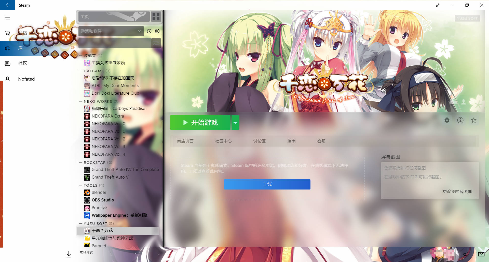

# Threshold Yuzu Soft Skin for Steam
From [Threshold-Miku](https://github.com/Jack-Myth/Threshold-Miku/tree/master).
This branch is for **Senren*Banka**.

Want a dark version? [Try this!](https://github.com/Nofated095/Threshold-Yuzu/tree/CafeStella)

Original Content From Jack-Myth/Threshold-Miku

## How to Install
 Download the skin,extract the zip file,then Run Install.cmd, it will automatically install to your steam.  
 Or  
 copy the folder to:
   * Windows - C:\Program Files (x86)\Steam\skins
   * Mac - /Users/\<username\>/Library/Application Support/Steam/Steam.AppBundle/Steam/Contents/MacOS/skins/
   * Linux - ~/.steam/skins

In Arch Linux(& Arch derivatives like Manjaro), you can use AUR packages [Dark](https://aur.archlinux.org/packages/threshold-miku-dark-steam-skin)/[Light](https://aur.archlinux.org/packages/threshold-miku-light-steam-skin)

## How to Use
1. In Steam, go to Settings > Interface > and choose Threshold Miku from the list of skins.
2. Restart Steam and enjoy!

# Introduce the Threshold Miku Light For SteamUI
  

# Collapsed Sidebar is also supported!  
  
Use "Threshold Miku Customizer" to apply this Style.   

# New Threshold Miku Customizer is included!  
[Source code here!](https://github.com/Jack-Myth/Threshold-Miku-Customizer-2)  
  

# Q/A  
Q: Why my skin looks like this?  
  
A: Make sure you have the same setting on both sides.  

## Copyright

All the assets and images are the creation of [YUZUSOFT/JUNOS inc.](https://www.yuzu-soft.com/). © 2022 YUZUSOFT/JUNOS inc. all rights reserved.